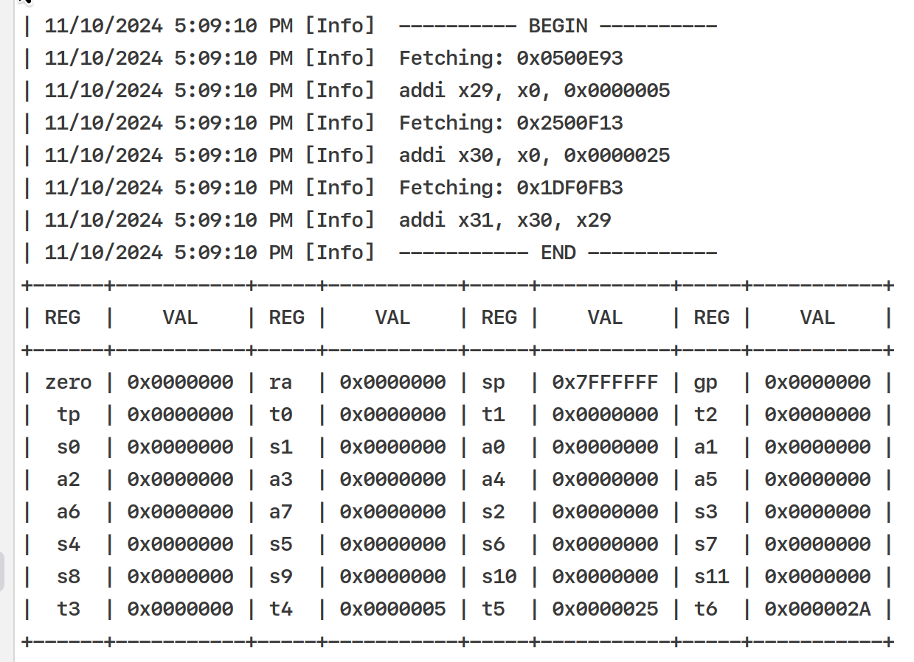

<div align="center">


# RISC-V.NET

*RISC-V Emualtor running in the Browser, Native or .NET CLR*


</div>

## Intro.

- <a href="https://riscv.org/">  RISC-V is an open standard Instruction Set Architecture (ISA) enabling a new era of processor innovation through open collaboration </a>

- <a href="https://dotnet.microsoft.com/en-us/languages/fsharp">  F# is an open-source language that makes it easy to write succinct, robust, and performant code. </a>

This project aims to run RISC-V Emulator
- on .NET CLR
- on Native (.NET Native AOT)
- [MAYBE] on Browser through WASM (https://fsbolero.io/)
- [MAYBE] on Browser through JS (https://fable.io/)



> [!WARNING]
> As you can see, this is not a mature solution, and it is almost impossible to become a mature solution. The performance of the simulator built through the above solution will inevitably have serious problems. The value of this project lies in my personal research and study, or to bring inspiration to others `:)`

```
| 11/11/2024 10:15:17 PM [Info] LOADING MEMORY
| 11/11/2024 10:15:17 PM [Info] A 12-byte EXECUTABLE FILE HAS BEEN LOADED
| 11/11/2024 10:15:17 PM [Info] BUS SUCCESSFULLY INSTALLED
| 11/11/2024 10:15:17 PM [Info] ---------- BEGIN ----------
| 11/11/2024 10:15:17 PM [Info] addi x29, x0, 0x0005
| 11/11/2024 10:15:17 PM [Info] addi x30, x0, 0x0025
| 11/11/2024 10:15:17 PM [Info] add x31, x30, x29
| 11/11/2024 10:15:17 PM [Info] ----------- END -----------
+------+-----------+-----+-----------+-----+-----------+-----+-----------+
| REG  |    VAL    | REG |    VAL    | REG |    VAL    | REG |    VAL    |
+------+-----------+-----+-----------+-----+-----------+-----+-----------+
| zero | 0x0000000 | ra  | 0x0000000 | sp  | 0x7FFFFFF | gp  | 0x0000000 |
|  tp  | 0x0000000 | t0  | 0x0000000 | t1  | 0x0000000 | t2  | 0x0000000 |
|  s0  | 0x0000000 | s1  | 0x0000000 | a0  | 0x0000000 | a1  | 0x0000000 |
|  a2  | 0x0000000 | a3  | 0x0000000 | a4  | 0x0000000 | a5  | 0x0000000 |
|  a6  | 0x0000000 | a7  | 0x0000000 | s2  | 0x0000000 | s3  | 0x0000000 |
|  s4  | 0x0000000 | s5  | 0x0000000 | s6  | 0x0000000 | s7  | 0x0000000 |
|  s8  | 0x0000000 | s9  | 0x0000000 | s10 | 0x0000000 | s11 | 0x0000000 |
|  t3  | 0x0000000 | t4  | 0x0000005 | t5  | 0x0000025 | t6  | 0x000002A |
+------+-----------+-----+-----------+-----+-----------+-----+-----------+
```

## Reference
- [RISC-V Assembler Reference](https://mark.theis.site/riscv/asm)
- [RISC-V ISA: A rapid way to learn the RISC-V ISA](https://risc-v.guru/instructions/)
- [The RISC-V Instruction Set Manual Volume I: Unprivileged ISA](https://github.com/riscv/riscv-isa-manual/releases/download/Ratified-IMAFDQC/riscv-spec-20191213.pdf)
- [The RISC-V Instruction Set Manual Volume II: Privileged Architecture](https://github.com/riscv/riscv-isa-manual/releases/download/Priv-v1.12/riscv-privileged-20211203.pdf)
- [rvemu: RISC-V emulator for CLI and Web written in Rust with WebAssembly. It supports xv6 and Linux (ongoing)](https://github.com/d0iasm/rvemu)
- [Writing a RISC-V Emulator in Rust](https://book.rvemu.app/)

## License
The MIT License (MIT)

Copyright (c) 2022 Muqiu Han

Permission is hereby granted, free of charge, to any person obtaining a copy
of this software and associated documentation files (the "Software"), to deal
in the Software without restriction, including without limitation the rights
to use, copy, modify, merge, publish, distribute, sublicense, and/or sell
copies of the Software, and to permit persons to whom the Software is
furnished to do so, subject to the following conditions:

The above copyright notice and this permission notice shall be included in all
copies or substantial portions of the Software.

THE SOFTWARE IS PROVIDED "AS IS", WITHOUT WARRANTY OF ANY KIND, EXPRESS OR
IMPLIED, INCLUDING BUT NOT LIMITED TO THE WARRANTIES OF MERCHANTABILITY,
FITNESS FOR A PARTICULAR PURPOSE AND NONINFRINGEMENT. IN NO EVENT SHALL THE
AUTHORS OR COPYRIGHT HOLDERS BE LIABLE FOR ANY CLAIM, DAMAGES OR OTHER
LIABILITY, WHETHER IN AN ACTION OF CONTRACT, TORT OR OTHERWISE, ARISING FROM,
OUT OF OR IN CONNECTION WITH THE SOFTWARE OR THE USE OR OTHER DEALINGS IN THE
SOFTWARE.